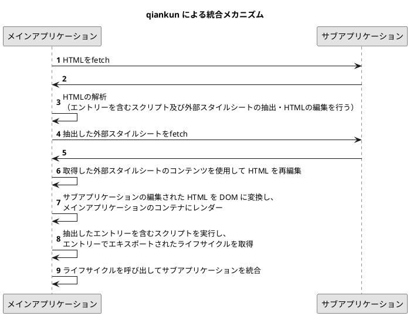

## はじめに

こんにちは、READYFOR のテックリード兼フロントエンドエンジニアの菅原（[@kotarella1110](https://twitter.com/kotarella1110)）です！
READYFOR はクラウドファンディングのプラットフォームで、数年前に実行者（プロジェクトを掲載するユーザー）向けの管理画面をリニューアルし、その際にマイクロフロントエンドアーキテクチャを採用しました。
[管理画面リニューアルのベータ版リリース時](https://corp.readyfor.jp/news/20221121)は三つの独立したフロントエンドアプリケーションを統合し、一つの統一されたアプリケーションとして提供していましたが、その後の機能追加によりフロントエンドアプリケーションが増え、現在では六つのフロントエンドアプリケーションを統合して提供しています。
この統合には、[qiankun](https://qiankun.umijs.org)（チェンクン）というマイクロフロントエンドフレームワークを使用しています。
本記事では qiankun によるマイクロフロントエンドの統合メカニズムついて説明したいと思います。

マイクロフロントエンドの詳細について説明致しませんので、以下のリンク先の記事をご参照ください。

https://intro-to-micro-frontends.netlify.app

https://zenn.dev/silverbirder/books/2d4da5d033685752d1c7

## qiankun とは？

qiankun は、[Ant Design](https://ant.design) などで有名な [Ant Group](https://www.antgroup.com/en) によって開発・メンテナンスされているマイクロフロントエンドフレームワークです。異なる技術スタックや独立したサービスとして機能する複数のフロントエンドアプリケーションを統合し、一つの統一されたアプリケーションを簡単かつ手間なく構築できます。
マイクロフロントエンドフレームワークとして人気な [single-spa](https://single-spa.js.org) のラッパーであり、single-spa の欠点や問題点を解決しています。
[マイクロフロントエンドを構築する際の組成パターン](https://zenn.dev/silverbirder/books/2d4da5d033685752d1c7/viewer/2a2ff6)は多岐に渡りますが、qiankun はクライアントサイド組成パターンのフレームワークです。

## qiankun での実装の仕方

[qiankun の Getting Started](https://qiankun.umijs.org/guide/getting-started) にも実装の仕方が記載されていますが、以下に簡単な実装の仕方を紹介します。また、以前に qiankun の実装例を GitHub に公開していますので、参考にしてください。

https://github.com/kotarella1110-sandbox/micro-frontends-qiankun-example

### メインアプリケーションの実装

qiankunでは、一つのメインアプリケーションの上に複数のサブアプリケーションが配置される構成となります。

#### qiankun のインストール

メインアプリケーション側では、qiankun をインストールする必要があります。

```shell
npm install qiankun
```

#### サブアプリケーションの登録

メインアプリケーションのエントリーファイルでは以下のようにサブアプリケーションを登録します。以下のコードでは、ブラウザの URL が `/path1` に変更されると http://localhost:5001 で起動しているサブアプリケーションが `#container` にマウント（表示）され、`/path2` に変更されると http://localhost:5002 で起動しているサブアプリケーションがマウントされます。

```js
import { registerMicroApps, start } from "qiankun";

registerMicroApps([
  {
    name: "subApp1", // サブアプリケーションの名前
    entry: "//localhost:5001", // サブアプリケーションの URL
    container: "#container", // サブアプリケーションをマウントする要素
    activeRule: "/path1", // サブアプリケーションをマウントするパス
  },
  {
    name: "subApp2",
    entry: "//localhost:5002",
    container: "#container",
    activeRule: "/path2",
  },
]);

start();
```

### サブアプリケーションの実装

サブアプリケーション側では、メインアプリケーションに統合するための追加の依存関係をインストールする必要はありません。

#### qiankun のライフサイクルをエクスポート

サブアプリケーションのエントリーファイルでは、`bootstrap`、`mount`、`unmount`という3つのライフサイクルを必ずエクスポートする必要があります。これは、メインアプリケーション（qiankun）が適切なタイミングでこれらのライフサイクルを呼び出せるようにするためです。メインアプリケーション側でこれらのライフサイクルを呼び出して、サブアプリケーションをメインアプリケーションに統合します。

```js
import { createRoot, Root } from "react-dom/client";
import App from "./App";

// サブアプリケーションに動的にロードされるスクリプト、スタイル、イメージ、その他のアドレスが正しくない問題に対処します。
if (window.__POWERED_BY_QIANKUN__) {
  window.__webpack_public_path__ = window.__INJECTED_PUBLIC_PATH_BY_QIANKUN__;
}

let root;

const render = (props) => {
  // コンテナ要素を見つけます。`props.container` は、メインアプリケーション（qiankun）側での `mount` の呼び出し時に引数として渡されるサブアプリケーションのマウント先です。`props.container` があれば使用し、そうでなければデフォルトの `#root` を使用します。
  const container = props?.container
    ? props.container.querySelector("#root")
    : document.getElementById("root");
  root = createRoot(container);

  root.render(<App {...props} />);
};

// window.__POWERED_BY_QIANKUN__ がない場合は、単独で通常のアプリケーションとしてレンダリングします。
if (!window.__POWERED_BY_QIANKUN__) {
  render();
}

/**
 * メインアプリケーション（qiankun）が呼び出すライフサイクルを定義する
 */

// サブアプリケーションが初期化されるときにのみ呼び出されます。サブアプリケーションがメインアプリケーションから再度アクセスされると、`bootstrap` が繰り返し呼び出されず `mount` が直接呼び出されます。
export async function bootstrap() {
  console.log(`subApp1 bootstrap`);
}

// サブアプリケーションがアクセスされる度に呼び出されます。
export async function mount(props) {
  console.log(`subApp1 mount`, props);
  render(props);
}

// アプリケーションの切り替わったりアンロードされる度に呼び出されます。
export async function unmount(props) {
  console.log(`subApp1 unmount`, props);
  root.unmount();
}

// オプションのライフサイクル。qiankun の loadMicroApp でのみ呼び出されます。
export async function update(props) {
  console.log(`subApp1 update`, props);
}
```

#### サブアプリケーションのバンドラー設定

サブアプリケーションのエントリーファイルでライフサイクルをエクスポートしただけでは、メインアプリケーション側からライフサイクルを呼び出すことができません。そのため、以下のようにバンドラーを設定して UMD 形式でビルドする必要があります。

```js:webpack.config.js
module.exports = {
  //...
  output: {
    //...
    library: `subApp1-[name]`,
    libraryTarget: "umd",
    chunkLoadingGlobal: `webpackJsonp_subApp1`,
  },
};
```

UMD 形式にする理由は、エントリーファイルでエクスポートされた関数や変数がブラウザの `window` オブジェクトに保持されるようにするためです。これらが `window` オブジェクトに保持される際の名前は、webpack の設定で指定された `library` オプションによって決まります。上の設定では、`library` オプションに `subApp1-[name]` という値が指定されています。そのため、エクスポートされた関数や変数は、 `window` オブジェクトに `subApp1-モジュール名` という名前で保持されます。ブラウザでエントリーファイルを読み込んだ後、エクスポートされたライフサイクルには、以下のように `window["subApp1-モジュール名"]` という名前でアクセスできるようになります。

```js
console.log(window["subApp1-main"]);
/*
{
  bootstrap: ƒ (),
  mount: ƒ (props),
  unmount: ƒ (props),
  update: ƒ (),
  __esModule: true,
  Symbol(Symbol.toStringTag): "Module",
  get bootstrap: () => { ... },
  get mount: () => { ... },
  get unmount: () => { ... },
  get update: () => { ... },
  [[Prototype]]: Object
}
*/
window["subApp1-main"].bootstrap(); // qiankun 側ではこのようにライフサイクル関数を呼び出す
```

## qiankun による統合メカニズム

先述の実装を通じて、qiankun を使用することで簡単にマイクロフロントエンドを構築できることが分かりました。
続いて qiankun による統合メカニズムについて理解していきましょう。
以下は、qiankunによる統合のシーケンス図です。


:::details plantuml



:::

このシーケンス図に沿って、qiankun による統合メカニズムについて詳しく説明します。

### 1〜2. サブアプリケーションの HTML を fetch する

qiankun はメインアプリケーションからサブアプリケーションをロードして統合するために [import-html-entry](https://github.com/kuitos/import-html-entry) の `importEntry` という API を呼び出します。`registerMicroApps` に渡された `entry`（サブアプリケーションの URL）は、`importEntry` の第一引数として渡されます。

https://github.com/umijs/qiankun/blob/eeebd3f76aa3a9d026b4f3a4e86682088e6295c1/src/loader.ts#L266

https://github.com/kuitos/import-html-entry/blob/3a1a1c451f5256fa20c181ce9f08963f2f2eae94/src/index.js#L302-L347

続いて、`entry`（サブアプリケーションの URL）は `string` のため、`importHTML` 関数を呼び出します。

https://github.com/kuitos/import-html-entry/blob/3a1a1c451f5256fa20c181ce9f08963f2f2eae94/src/index.js#L311-L318

https://github.com/kuitos/import-html-entry/blob/3a1a1c451f5256fa20c181ce9f08963f2f2eae94/src/index.js#L251-L300

`importHTML` は、サブアプリケーションの URL で fetch して HTML を取得します。

https://github.com/kuitos/import-html-entry/blob/3a1a1c451f5256fa20c181ce9f08963f2f2eae94/src/index.js#L276

### 3. HTML の解析

その後、`processTpl` 関数で、先程取得した HTML の解析を行います。
HTML からエントリースクリプト（`entry`）や HTML 内の全てのスクリプト（`scripts`）、HTML 内の外部スタイルシート（`styles`）を抽出し、HTML を編集します。この編集には、`<script>` や `<link>` による外部スタイルシートのコメントアウトや置き換えが含まれます。編集された HTML は `template` に格納されます。

https://github.com/kuitos/import-html-entry/blob/3a1a1c451f5256fa20c181ce9f08963f2f2eae94/src/index.js#L281

### 4〜5. 抽出した外部スタイルシートの fetch

次に、`getEmbedHTML` 関数で、`processTpl` 関数で抽出した外部スタイルシートを fetch して取得します。

https://github.com/kuitos/import-html-entry/blob/master/src/index.js#L283

https://github.com/kuitos/import-html-entry/blob/3a1a1c451f5256fa20c181ce9f08963f2f2eae94/src/index.js#L38-L50

### 6. 取得した外部スタイルシートのコンテンツを使用して HTML を再編集

`template` 内の先程コメントアウトした `<link>` による外部スタイルシートを `<style>` によるインラインスタイルに置き換えます。

https://github.com/kuitos/import-html-entry/blob/3a1a1c451f5256fa20c181ce9f08963f2f2eae94/src/index.js#L44-L48

### 7. サブアプリケーションの編集された HTML を DOM に変換し、メインアプリケーションのコンテナにレンダー

最終的に、`importEntry` が返すオブジェクトには、以下のものが含まれます。
これらのうち、qiankun で特に重要なのが `template` と `execScripts` です。`template` は先程編集した HTML が格納され、`execScripts` は `processTpl` 関数で抽出したエントリースクリプトと全てのスクリプトを実行するための関数です。インラインスクリプトであればそのまま実行され、外部スクリプトがあれば スクリプトを fetch して取得し、そのスクリプトを実行します。

https://github.com/kuitos/import-html-entry/blob/3a1a1c451f5256fa20c181ce9f08963f2f2eae94/src/index.js#L283-L298

スクリプトの実行には、以下の通り `eval` が使用されます。

https://github.com/kuitos/import-html-entry/blob/3a1a1c451f5256fa20c181ce9f08963f2f2eae94/src/utils.js#L171-L179

`execScripts` は、UMD 形式のエントリースクリプトを `eval` で実行することで、エキスポートされたライフサイクルを `window` オブジェクトに保持し、`window` オブジェクトに保持されたライフサイクルを Promise で返します。

https://github.com/kuitos/import-html-entry/blob/master/src/index.js#L187-L193

ここでようやく、qiankun 側に戻ってきます。

先程 `importEntry` で返却された `template` を DOM に変換し、メインアプリケーションのコンテナにレンダーします。

https://github.com/umijs/qiankun/blob/eeebd3f76aa3a9d026b4f3a4e86682088e6295c1/src/loader.ts#L277

https://github.com/umijs/qiankun/blob/eeebd3f76aa3a9d026b4f3a4e86682088e6295c1/src/loader.ts#L288-L293

https://github.com/umijs/qiankun/blob/eeebd3f76aa3a9d026b4f3a4e86682088e6295c1/src/loader.ts#L298-L302

### 8. 抽出したエントリーを含むスクリプトを実行し、エントリーでエキスポートされたライフサイクルを取得

その後、 `importEntry` で返却された`execScripts` でサブアプリケーションの全てのスクリプトを実行し、エントリースクリプトでエキスポートされたライフサイクルを取得します。

https://github.com/umijs/qiankun/blob/eeebd3f76aa3a9d026b4f3a4e86682088e6295c1/src/loader.ts#L347-L355

### 9. ライフサイクルを呼び出してサブアプリケーションを統合

これらのライフサイクルをメインアプリケーションから呼び出すことで、サブアプリケーションのマウントやアンマウントを制御し統合することができます。

## おわりに

本記事では、qiankun を使用したマイクロフロントエンドの統合メカニズムについて詳しく解説しました。qiankun を利用することで、異なる技術スタックや独立したサービスとして機能する複数のフロントエンドアプリケーションを統合し、一つの統一されたアプリケーションを簡単かつ効率的に構築することが可能です。実装方法や統合の仕組みを理解することで、マイクロフロントエンドの開発や管理をスムーズに行うことができます。

また、qiankun の興味深い機能の一つに、サンドボックスと呼ばれるサブアプリケーション間で JavaScript とスタイルを分離する機能があります。この機能を有効にすることで、サブアプリケーション間での JavaScript のグローバル変数やイベントの衝突や競合を防ぎ、スタイルが互いに干渉することを防いでくれます。この実現方法についてもなかなか面白いので、時間があれば別の記事で詳しく紹介したいと考えています。
